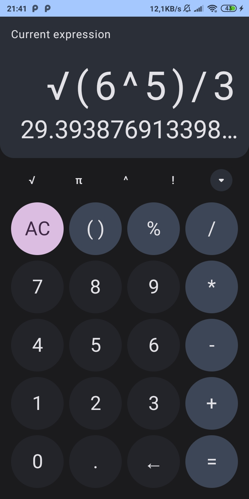

# Jetpack compose calculator

A jetpack compose calculator clone of google calculator written with 100% Jetpack Compose.

This calculator uses an implementation of the [ExprK](https://github.com/Keelar/ExprK) library to calculculate expression.

## Features
- Jetpack Compose
- Material 3
- MVVM